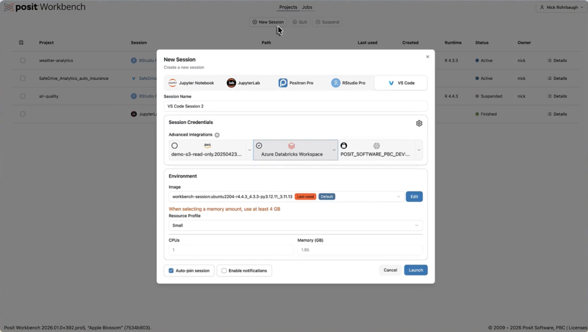
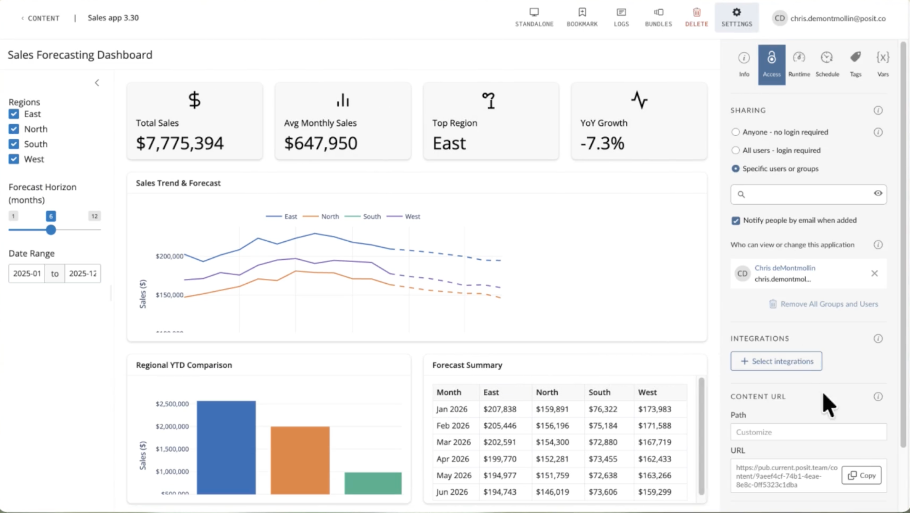

## Agenda

| Time | Topic |
|---|---|
| 4:00–4:05 | Welcome and introductions |
| 4:05–4:20 | Workbench and Connect 101 |
| 4:20–4:30 | Pilot overview and rollout |
| 4:30–4:35 | Connect subdomain |
| 4:35–4:50 | Governance, administration, and training needs |
| 4:50–5:00 | Questions and next steps |

## Introductions

Please briefly share:

1. Your name
2. Your role at DWR
3. Your current favorite data science project

## Today’s outcomes

By the end of this kickoff, developers (you all!) should understand:

- What Posit Workbench and Connect each provide during the pilot
- The structure of the Posit pilot
- Where we need developer input

## The Posit pilot

DWR is evaluating whether a shared Posit platform can make modern data science workflows and products easier to develop, run, and publish.

::: columns
::: {.column width="50%"}
### Workbench

Browser-based development environments and enhanced compute for RStudio, Jupyter, Positron, and VS Code.
:::
::: {.column width="50%"}
### Connect

A managed place to one-click publish and share supported data science products through a browser.
:::
:::

 

::: {.callout}
**Pilot capacity:** 10 developer licenses for Workbench and Connect publishing, plus up to 100 private Connect viewer accounts.
:::

## Workbench features

- Choose the IDE that fits the task: RStudio, Positron, VS Code, or JupyterLab
- Work in durable server-side sessions: return to your projects and monitor running jobs
- Use centrally managed runtimes, tools, and extensions instead of building every workstation from scratch

::: {.notes}
Sources: [Workbench User Guide](https://docs.posit.co/ide/server-pro/user/posit-workbench/guide/session-management.html) and [Workbench Administrator Guide](https://docs.posit.co/ide/server-pro/admin/).
:::

## Workbench features

- Access compute and memory resources
- Run long-running or batch jobs using shared compute infrastructure
- _Access large language model coding support_*  
- _Connect securely to data stores_*  

::: {.callout}
**Eventual Workbench URL:** `workbench.water.ca.gov`  

_VPN access not required; login administered through Entra ID_
:::

::: {.slide-footnote}
<em>* Eventually!</em>
:::

::: {.notes}
Sources: [Workbench Job Launcher](https://docs.posit.co/ide/server-pro/admin/job_launcher/configuration.html) and [resource profiles](https://docs.posit.co/ide/server-pro/admin/getting_started/installation/kubernetes_installation.html).
:::

## Workbench screenshot {.screenshot-slide}

{fig-alt="Screenshot of the Posit Workbench interface" .screenshot}

## Connect features

- Publish many types of work in one place: Quarto, Shiny, Streamlit, dashboards, APIs, and static content
- Deploy a bundle of source code and supporting files; Connect can restore the R or Python environment it needs

::: {.notes}
Sources: [Connect User Guide](https://docs.posit.co/connect/user/) and [Publishing overview](https://docs.posit.co/connect/user/publishing-overview/).
:::

## Connect features

- Manage collaborators, viewers, and ownership separately for each product
- Give products memorable custom paths and update them as code or data change
- Schedule reports and distribute results by email when publishing source code

::: {.callout}
**Eventual Connect URL:** TBD 
:::

::: {.notes}
Sources: [Content management](https://docs.posit.co/connect/admin/content-management/index.html) and [Scheduling](https://docs.posit.co/connect/user/scheduling/).
:::

## Connect screenshot {.screenshot-slide}

{fig-alt="Screenshot of the Posit Connect interface" .screenshot}

## What this does and does not solve

| Posit can help with | Product owners still need to consider |
|---|---|
| Development environments and compute | Data governance and privacy |
| Reproducible analytical workflows | Information security and accessibility |
| Standardized publishing | Testing, documentation, and review |
| Sharing through a browser | Long-term ownership and maintenance |
| Managed development and publishing workflows | Source control, peer review, and change management |

## Pilot rollout: platform foundation

1. [Confirm the pilot architecture, capacity, ownership, and success criteria.]{.status-complete}
2. [Provision dedicated Workbench and Connect server VMs, storage, and operating systems.]{.status-complete}
3. Configure DNS, TLS certificates, reverse proxy/load balancer, firewall rules, and required outbound access.
4. [Install and license Workbench and Connect; install supported R, Python, and Quarto runtimes.]{.status-in-progress}
5. [Configure Entra ID/Active Directory authentication, user provisioning, security groups, and roles.]{.status-in-progress}

::: {.notes}
Sources: [Connect system requirements](https://docs.posit.co/connect/admin/getting-started/requirements/), [Connect installation](https://docs.posit.co/connect/admin/getting-started/local-install/), and [Workbench authentication and user provisioning](https://docs.posit.co/ide/server-pro/admin/getting_started/installation/kubernetes_installation.html).
:::

## Pilot rollout: readiness and launch

6. Configure Workbench resource profiles and Connect execution/package environments; set up approved data, secrets, and email integrations.
7. Establish monitoring, audit/log review, backups and recovery, and support escalation.
8. Structure governance for publishing, access, ownership, maintenance, accessibility, and data handling.
9. Complete user acceptance testing: sign-in, sessions, compute, publishing, sharing, and scheduling.
10. Onboard pilot users, deliver training, collect feedback, and iterate.

::: {.notes}
Sources: [Workbench resource profiles](https://docs.posit.co/ide/server-pro/admin/getting_started/installation/kubernetes_installation.html), [Connect execution environments](https://docs.posit.co/connect/admin/appendix/off-host/execution-environments/index.html), [Connect administration](https://docs.posit.co/connect/admin/), and [Connect backups](https://docs.posit.co/connect/admin/server-management/backups/).
:::

## Choose the Connect address

The Workbench address is clear: `workbench.water.ca.gov`. Connect needs an equally clear, durable address. This address will direct to a public-facing landing page that can be fully customized.

 

| Candidate | Signal it sends | Consideration |
|---|---|---|
| `connect.water.ca.gov` | Names the product directly | May be less intuitive to non-developers |
| `publish.water.ca.gov` | Emphasizes the user outcome | Could sound broader than the platform |
| `tools.water.ca.gov` | Allows room for multiple tools | Is less specific about purpose |

  

::: {.callout .decision}
**Discussion:** Which name will be clearest for authors, viewers, administrators, and future services?
:::

## Governance: what should the pilot establish?

- **Audience and access:** What is the default sharing level, and who can approve broad internal or public access?
- **Product ownership:** What named owner, backup owner, source repository, and maintenance or retirement plan should each product have?
- **Publication readiness:** What lightweight checks apply before publishing, and which products need a higher review bar?
- **Operations and support:** What belongs to product authors versus platform administrators?

::: {.callout .decision}
**Discussion:** What guardrails would help you publish confidently without turning ordinary analytical products into a lengthy deployment process?
:::

::: {.notes}
Sources: [Connect access controls](https://docs.posit.co/connect/admin/access-controls/) and [Connect content management](https://docs.posit.co/connect/admin/content-management/index.html).
:::

## Governance: shared administrative coverage

- Establish at least two platform administrators
- Pair on routine administration and support work
- Document configuration, operating practices, Active Directory groups, and key contacts
- Build confidence through hands-on rotation and shadowing

## Governance: lightweight pilot working group

- Include potential platform administrators, pilot developers, and relevant governance partners
- Meet briefly and regularly during the pilot
- Recommend guardrails, resolve escalations, and maintain a decision log
- Define success measures, review evidence and feedback, and refine pilot practices

::: {.notes}
Sources: [Workbench administrative dashboard](https://docs.posit.co/ide/server-pro/admin/server_management/administrative_dashboard.html) and [Connect administration](https://docs.posit.co/connect/admin/).
:::

## Defining pilot success

The pilot working group will develop and review a practical success framework. Candidate dimensions could include:

- **Useful:** Does the platform help developers complete real work more effectively?
- **Adopted:** Are pilot users returning to it and bringing meaningful use cases?
- **Delivered:** Are useful products reaching their intended audiences?
- **Sustainable:** Can DWR operate the platform with appropriate security, governance, and support?

::: {.callout .decision}
**Discussion:** What outcomes would make you say this pilot was worth continuing, and what evidence would convince you?
:::

## Training: what would help you publish confidently?

What support would be most useful first?

- Getting started in Workbench and working with projects
- Publishing a Quarto report or application to Connect
- Managing access and selecting an audience
- Reproducibility, environments, and dependencies
- Accessibility and product owner responsibilities

What training mechanisms would be helpful?

## Next steps

1. Select a recommended Connect subdomain.
2. Identify shared administrators.
3. Form a lightweight pilot governance working group.
4. Capture rollout, governance, training, and pilot success follow-ups products.
5. Identify initial pilot workflows to test.
6. Share access and support details when rollout information is finalized.

## Thank you!

Any questions?

Pilot documentation and updates: [github.com/DWR-Open-Science/posit-tooling](https://github.com/DWR-Open-Science/posit-tooling)
